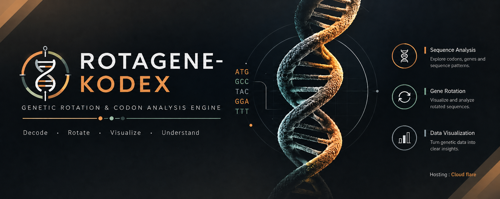

  

# 🧬 RotageneKodex

### *Interactive Codon Dialer & Genetic Code Laboratory*

> **RotageneKodex** is an interactive visualization exploring the **Genetic Code**, codon decoding, protein synthesis, and mutation through a browser-based molecular biology laboratory.
>
> 🧬 **Genetics** · 🧪 **Molecular Biology** · 🧫 **Protein Synthesis**

**🔬 [Explore the Simulation](https://rotagene-kodex.dray-ashcroft.workers.dev/)**

---

## ✦ Features

**🧬 3-Ring Codon Dialer**  
Interactively decode mRNA codons and identify their corresponding amino acids.

**🧪 Real-time Translation**  
Translate mRNA sequences into their corresponding amino acid sequences.

**🧬 Mutation Simulator**  
Explore **silent, missense, and nonsense mutations** and their effects on protein coding.

**📋 Codon Reference**  
Explore an interactive reference of all **64 codons** and their corresponding amino acids.

---

## 🧬 Core Concepts

**Genetic Code · Codons · Anticodons · Translation · Protein Synthesis · Mutations · Amino Acids**

---

## ⚙️ Technology

**HTML · CSS · JavaScript**

**Repository:** GitHub & Codeberg  
**Hosting:** Cloudflare

---

## 📜 License

Distributed under the **GNU General Public License v3.0 (GPL-3.0)**.
